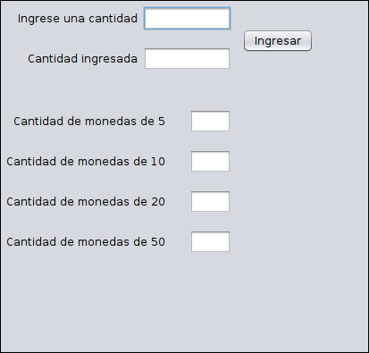
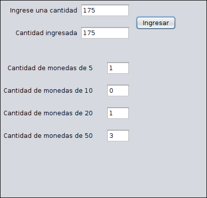

# Programa: pago con monedas

Programa que calcula la cantidad mínima de monedas para pagar un monto específico.

Las denominaciones de las monedas son:

* 5
* 10
* 20
* 50

## Consideraciones

* Lenguaje de programación Java
* OpenJDK 11.0
* Apache Netbeans 12.0
* Ubuntu MATE 20.04

## Capturas

**Pantalla principal**

**Funcionamiento**

